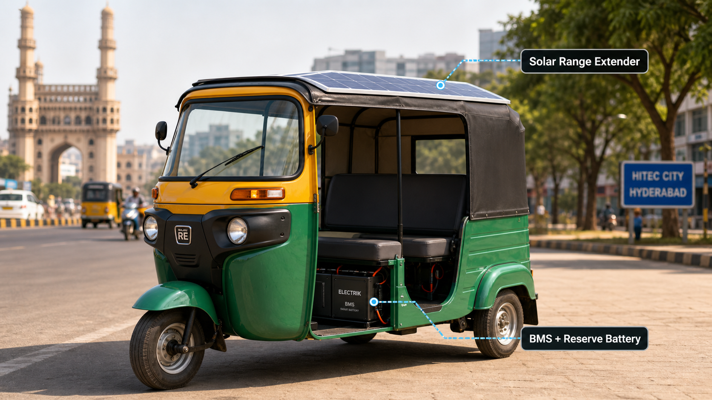

# System Overview

SuryaChakra is building a practical clean-mobility ecosystem for India’s last-mile transport sector. The mission is to make electric mobility affordable, resilient, and locally serviceable by combining retrofit technology, portable charging infrastructure, and solar-powered range extension into one coherent platform.

The vision is simple: every small commercial vehicle should be able to operate with lower cost, lower emissions, and greater energy independence. SuryaChakra aims to create a system that helps drivers, fleet operators, and local entrepreneurs transition from fuel dependence to cleaner, more reliable electric operation.

## The system in one view

The entire system can be decomposed into three main parts:

1. EV Retrofit Kit
2. Fast Charging Station - Portable
3. Solar Range Extender

Each part serves a different role in the energy and mobility value chain, but together they form a complete solution for retrofit adoption and daily operation.

## 1. EV Retrofit Kit

The EV retrofit kit converts existing vehicles into electric-ready platforms with minimal disruption to their form factor and use case. It is designed to be modular, repairable, and suitable for local deployment.

This layer provides the core vehicle-level transformation:

- Battery pack integration
- Motor and controller adaptation
- Vehicle control and safety systems
- Lightweight installation approach for common commercial vehicles

The retrofit kit is the first step toward making electric mobility accessible to users who cannot afford a brand-new EV.

## 2. Fast Charging Station - Portable

The portable charging station provides an energy distribution layer for fleets and remote locations. Instead of depending only on fixed grid infrastructure, SuryaChakra envisions mobile charging that can be brought to where the vehicles operate.

This component is essential for:

- Rapid energy top-up in field conditions
- Flexible deployment near transit hubs or parking areas
- Reduced downtime for fleet operations
- Better support for shared and high-utilization vehicles

The charging station makes the retrofit ecosystem practical in places where traditional charging infrastructure is limited or inconsistent.

## 3. Solar Range Extender

The solar range extender improves the usability of the retrofit system by adding a renewable energy input to extend the effective range and reduce dependency on frequent charging. It is intended to support daily travel with a more resilient, solar-assisted energy profile.

This layer helps to:

- Increase practical range in real-world use
- Reduce charging frequency during the day
- Improve energy resilience in off-grid or weak-grid environments
- Align the product with the long-term sustainability goals of the startup

## Why this matters

SuryaChakra is not just building vehicle hardware. It is building an ecosystem that connects retrofit adoption, charging access, and renewable support into a single path for cleaner transportation. The design philosophy is to make the system practical for local conditions, affordable for users, and flexible enough to scale over time.

## Summary

SuryaChakra’s system overview can be understood as a three-part platform:

- Retrofit the existing vehicle base
- Charge it flexibly with portable infrastructure
- Extend its daily range with solar power

Together, these parts create a meaningful step toward dependable, lower-cost, and more sustainable mobility.
